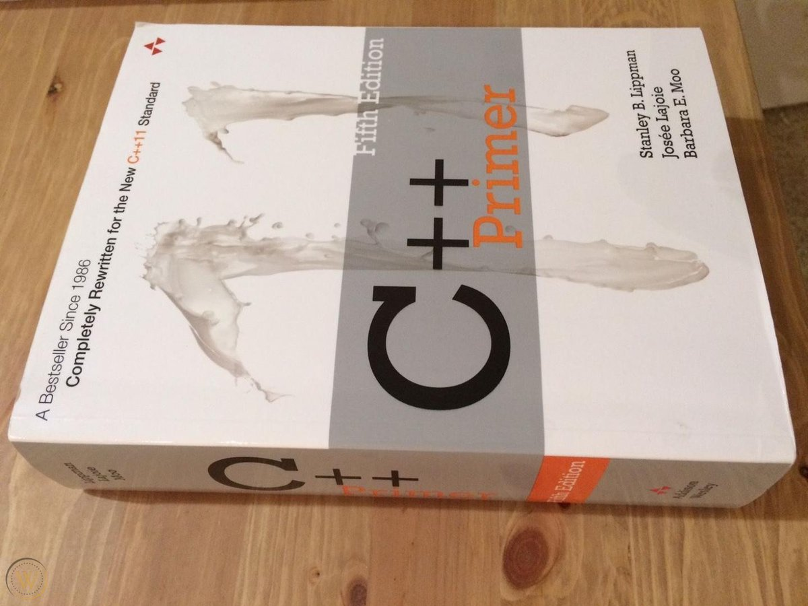

# 🚀 C++ Primer Journey: Building My Software Foundations in Public

I am Kerolos Essam, a recent Electronics and Communications Engineering graduate learning software development from the ground up. This repository contains my own notes, attempts, mistakes, and exercises while studying **C++ Primer, 5th Edition**.

The goal is not to look advanced. The goal is to become capable of writing, explaining, debugging, and improving C++ programs independently.

## 📊 Live Progress
**Last Updated:** August 26, 2026 
**Current Focus:** Chapter 2, Section 2.1 - Primitive Built-in Types 
**Next Goal:** Understand arithmetic types, type conversions, and literals, then complete the related exercises

| Chapter | Status | Notes | Exercises |
|---------|--------|-------|-----------|
| 1 | ✅ Completed | [Read](chapters/chapter-1/notes.md) | [View](chapters/chapter-1/Exercises) |
| 2 | 🔄 **In progress** | [Read](chapters/chapter-2/notes.md) | [View](chapters/chapter-2/Exercises) |
| 3 | ⏳ Upcoming | - | - |

## 🎬 YouTube Journey
> *"Documenting the struggle so others don't have to"*

I publish practical videos about what I build, what confused me, and what I learned from my mistakes.

## 🎯 Milestones
- [x] Set up a working C++ development environment
- [x] Complete Chapter 1
- [ ] Complete Chapter 2 and the Type Detective project
- [ ] Complete Chapter 3 and build a text analyzer
- [ ] Complete *C++ Primer*
- [ ] Build several projects I can explain without assistance
- [ ] Build one serious portfolio capstone

## 🧭 Learning Rules

- Attempt every exercise before asking AI for help.
- Use AI for hints, questions, and code review—not ghostwritten solutions.
- Never publish code I cannot explain and rebuild.
- Record mistakes instead of hiding them.
- Prefer genuine understanding over streaks, commit counts, or rushed chapters.

## 🤝 How to Follow
1. **Star ⭐ this repo** to bookmark
2. **Watch 👁️** to get notifications
3. **Fork 🍴** to start your own journey
4. **Submit PRs** with improvements!

  
   
  <em>My learning companion: C++ Primer 5th Edition 🔥</em>

## 📝 Current Work

I have completed the Chapter 1 exercises and started Chapter 2. My current experiment intentionally demonstrates why an unsigned countdown condition can remain true after reaching zero.
